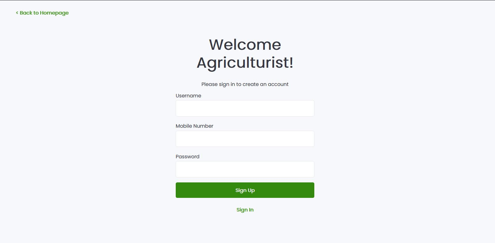
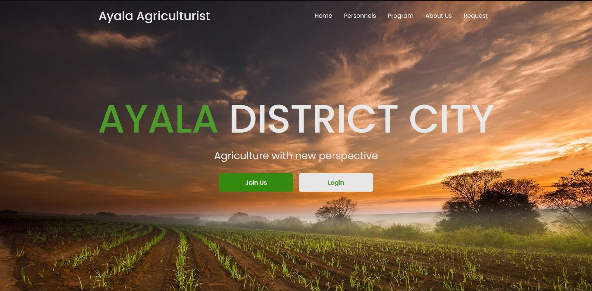
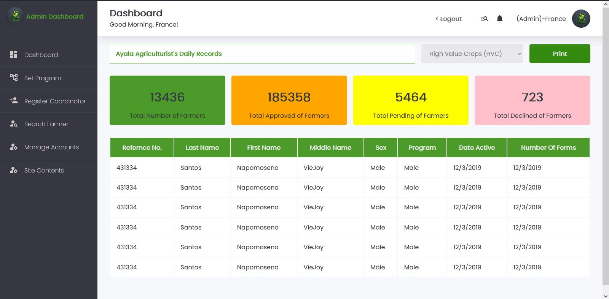
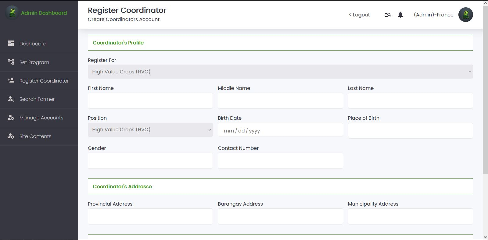

  

<h2 align="center">Agriculture Management System</h2>

🚀 A web application that allows an admin, personnel, and farmer to manage agricultural environments as in their role. 

## Screenshots

Signup

Homepage

Dashboard

Register Coordinator

## Technologies 

-   NodeJS - Server
-   ExpressJS - Nodejs framework
-   MySQL - Database
-   ReactJS - Frontend
-   Redux - State Management
-   Eslint - Linter
-   Webpack(pending) - Bundler
-   Babel - Loader and Compiler/Transpiler
-   Jest - Testing Framework

<!-- MEMBERS-LIST  -->
## MEMBERS 

<table align="center">
  <tr>
    <td align="center">
      <a href="https://github.com/france-stack007">
       
      <b>France Rebollos</b></a> <a href="COMMITS" title="Developer">🖥 Developer</a>
    </td>
    <td align="center">
      <a href="https://github.com/france-stack007">
       
      <b>Jethro Guerrero</b></a> <a href="COMMITS" title="Project Manager">📋 Project Manager</a>
    </td>
    <td align="center">
      <a href="https://github.com/knownasJenny">
       
      <b>Jenny Pieloor</b></a> <a href="COMMITS" title="UIUX Designer">🎨 UI/UX Designer</a>
    </td>
    <td align="center">
      <a href="https://github.com/thirdyfrancis1">
       
      <b>G-Third Francisco</b></a> <a href="COMMITS" title="uality Assurance">🧿 Quality Assurance </a>
    </td>
    <td align="center">
      <a href="https://github.com/france-stack007">
       
      <b>Morfydd Alar</b></a> <a href="COMMITS" title="Business Analyst">📈 Business Analyst</a>
    </td>
  </tr>
</table>
